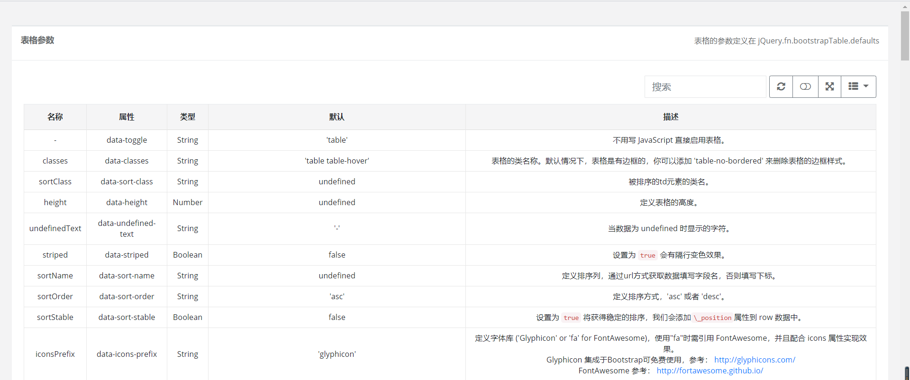
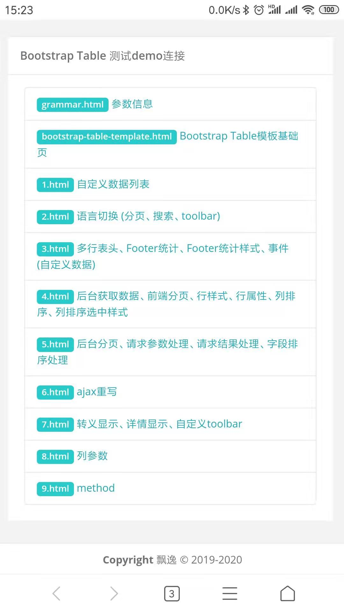

#### 初始化
###### 方案一、从零使用Bootstrap Table, 利用node.js下载依赖
> 初始化项目
```shell script
npm init
```
> Bootstrap 
```shell script
npm install bootstrap
```
> Bootstrap Table
```shell script
npm install bootstrap-table
```
> jquery.js
```shell script
npm install jquery
```
> Font Awesome 字体图标
```shell script
npm install font-awesome
```
> popper.js
```shell script
npm install popper.js
```
###### 方案二、使用npm install安装依赖
* 下载 package.json 到项目根目录
* npm install

#### 相关网站
* [Bootstrap Table官网](https://bootstrap-table.com/)
* [文档示例](https://examples.bootstrap-table.com/)
* [Github地址](https://github.com/wenzhixin/bootstrap-table/)

#### 目录介绍
* ./css             自定义css
* ./js              自定义js
* ./images          图片
* ./export          导出插件导出文件下载示例
* ./node_modules    依赖

#### 优点
> 自定义全局配置
```js
$.extend($.fn.bootstrapTable.defaults, {
    search: true
});
```
* 具体请参考（./js/bootstrap-table-custom.js）
* 全部可自定义配置项(摘自源码、具体配置内容请到源码进行查询查找)
```js
$.fn.bootstrapTable.Constructor = BootstrapTable;
$.fn.bootstrapTable.theme = Constants.THEME;
$.fn.bootstrapTable.VERSION = Constants.VERSION;
$.fn.bootstrapTable.defaults = BootstrapTable.DEFAULTS;
$.fn.bootstrapTable.columnDefaults = BootstrapTable.COLUMN_DEFAULTS;
$.fn.bootstrapTable.constants = BootstrapTable.CONSTANTS;
$.fn.bootstrapTable.events = BootstrapTable.EVENTS;
$.fn.bootstrapTable.locales = BootstrapTable.LOCALES;
$.fn.bootstrapTable.methods = BootstrapTable.METHODS;
$.fn.bootstrapTable.utils = Utils; // BOOTSTRAP TABLE INIT
```

> 所有参数描述（./grammar.html）



> node 包管理、更加快捷下载依赖
```shell script
npm install
```
> 界面使用 Bootstrap Table 布局，支持手机端


